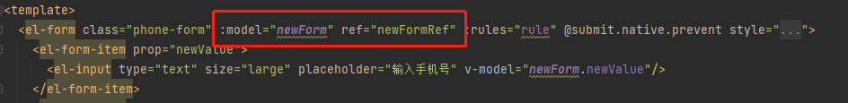
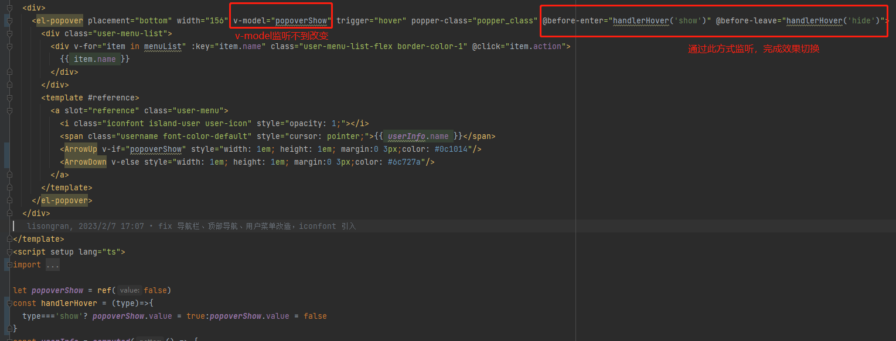

# zkzc-base-frontend-vue3 (基础脚手架)

框架技术： vue3 + vite + ts + pinia + element-plus + router4

工程vue3+vite搭建，基于zkzc-base-frontend上迁移

## 命令使用
```
npm install
npm run dev
```

`更新子模块`
```
git submodule init
git submodule update
```

## 代码提交
`type`：commit类型，取值如下：
- feat：新特性、新功能
- fix：修改bug
- docs：文档修改
- style：代码格式修改, 注意不是 css 修改
- refactor：代码重构
- perf：优化相关，比如提升性能、体验
- test：测试用例修改
- build：编译相关的修改，例如发布版本、对项目构建或者依赖的改动
- ci：持续集成修改
- chore：其他修改, 比如改变构建流程、或者增加依赖库、工具等
- revert：回滚到上一个版本
`subject`：commit目的的简短描述


## pinia基础使用方式
```
<script setup>
	import {useUserStoreWidthOut} from '@/store/modules/user'
	const userStore = useUserStoreWidthOut()
	userStore.personal
</script>
```


## vue2.x 升级 vue3.x

### prototype原型上挂载方法
- app.config.globalProperties.XXX
`在template模板中使用`
- {{XXX}}
`在setup中使用`
- import { getCurrentInstance } from 'vue'
- const { proxy } = getCurrentInstance()
- console.log(proxy.XXX)

### setup

- setup 是Vue3新增的一个选项，setup 执行时机是在beforeCreate之前执行，由于在执行setup 时尚未创建组件实例，因此在 setup 中没有 this
- 可通过getCurrentInstance()方法获取当前组件实例：const { proxy } = getCurrentInstance()

`setup语法糖简介`
- 直接在script标签中添加setup属性就可以直接使用setup语法糖了。
- 使用setup语法糖后，不用写setup函数；组件只需要引入不需要注册(建议还是写上，不然组件多了不知道在哪，找起来麻烦)；属性和方法也不需要再返回，可以直接在template模板中使用

### 路由的使用
- useRoute,useRouter 相当于vue2的 this.$route()，this.$router()
```
import { useRoute, useRouter } from 'vue-router'
const route = useRoute()
const router = useRouter()

router.push({name: XXX})
```

### ref获取DOM
```
<template>
    <div ref="myRef">我是dom</div>
</template>
const myRef = ref(null)
console.log(myRef.value)
```

### watch监听
```
const count = ref(0)
watch(count, (newValue, oldValue) => {
    /* 回调 */
})
```

```
watch(()=>state,()=> {  // 侦听父组件传递下来的数据（监听源需响应式引用或 getter 函数）
    /* 回调 */  
})
```

### computed
```
const personal = computed(() => {
    /* 获取store中的个性化配置 */
    return userStore.personal.portal
})
```

### 父子组件数据，方法传递
`子组件接收`
```
const props = defineProps({
    isCollapse: {
        type: Boolean,
        default: false,
    },
})
```

`子组件触发父组件方法`
```
import { ref, defineEmits } from "vue";
const count = ref(0);
const emits = defineEmits(["changeCount"]);
const handlerClick = () => {
  count.value++;
  emits("changeCount", count);
};
```


`父组件调用子组件方法`


```
// vue3 <scipt setup> 语法糖中， 必须通过`defineExpose`的方式把子组件暴露出来，这样父组件才可以使用
const resetForm = () => {
  if (validFormRef) {
      unref(validFormRef).resetFields()
   }
}
defineExpose({
  resetForm
})
```

### 样式
- src\assets\css\self.scss  `覆盖element-plus`
- src\assets\css\skin-default.scss  `皮肤主题`

`写法差异`

 | 属性 | old | new |
 | ---  | --- | --- |
 | deep | ::v-deep | :deep() |
 | height | $height/2 | ($height,2) |


## element-plus
`#icon使用`
```
<el-icon><ArrowDown /></el-icon>  //常规用法
<ArrowDown style="width: 1em; height: 1em; margin-right: 8px" />  //SVG图标,默认不携带任何属性
```

`input button尺寸问题`
- ele-plus的input中多了el-input__wrapper以及el-input__inner，ele-ui只有一层el-input
- ele-plus的size置空默認default，沒有了medium，medium控制台warn
  

| 属性 | large | medium | small | mini |
| ---  | --- | --- | --- | --- |
| ele-ui | 40 | 36 | 32 | 28 |
| ele-plus | 40 | 32(default) | 24 | 无 |

`el-form`
以前我们习惯ref和model用同样的命名，新框架中ref和model不能重名


`el-popover的坑`
监听不到el-popover中的v-model变化

